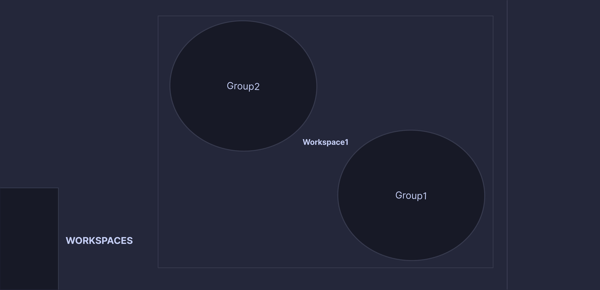
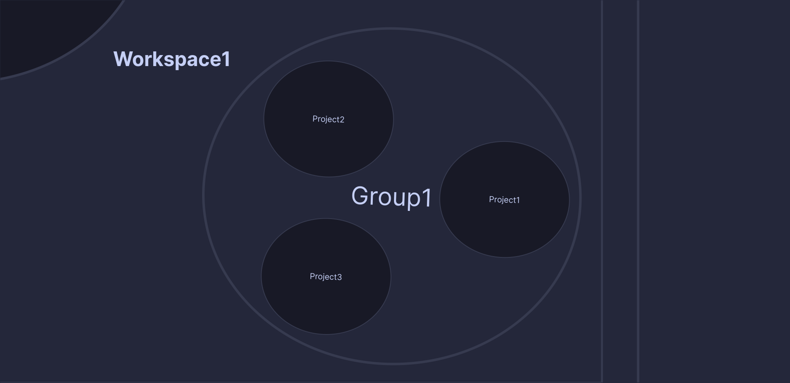
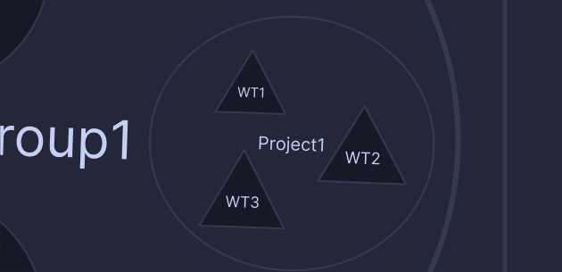

# Tmux-tsaheylu

## Installing

### Via TPM (recommended)

The easiest way to install `tmux-tsaheylu` is via the [Tmux Plugin Manager](https://github.com/tmux-plugins/tpm).

1.  Add plugin to the list of TPM plugins in `.tmux.conf`:

    ``` tmux
    set -g @plugin 'wabri/tmux-tsaheylu'
    ```

2.  Use `prefix`–`I` install `tmux-tsaheylu`. You should now be able to `tmux-tsaheylu` immediately.
3.  When you want to update `tmux-tsaheylu` use `prefix`–`U`.

### Manual Installation

1.  Clone the repository

    ``` sh
    $ git clone https://github.com/wabri/tmux-tsaheylu ~/clone/path
    ```

2.  Add this line to the bottom of `.tmux.conf`

    ``` tmux
    run-shell ~/clone/path/tsaheylu.tmux
    ```

3.  Reload the `tmux` environment

    ``` sh
    # type this inside tmux
    $ tmux source-file ~/.tmux.conf
    ```

You should now be able to use `tmux-tsaheylu` immediately.

### Requirements

In order for `tmux-tsaheylu` to work, there must be [fzf](https://github.com/junegunn/fzf) installed.

## Features

### Open Project

In the gif you can see the open_project feature in action:


Those are the keybinding used:

- `prefix`–`W` => open the project selection
- Select a workspace
- Select a group of the workspace
- Select a project in the group

When a project is selected tsaheylu create, if not already exists, a session with name `workspace/group/project` that we have selected and set the directory of the window with that path.

### Clone a project


Those are the keybinding used:

- `prefix`–`G` => open the cloning popup
- Paste the url
- Select a workspace (it is possible to create a new one)
- Select a group of the workspace (it is possible to create a new one)

After those selection the project will be clone as expected and once the project is correctly cloned than create a new session with the same rules used for [open project](#Open-Project).

### Manage gitworktree (TODO)

### Manage templates (TODO)

## Workspace structure

This plugin can manage workspaces that have at least 3 level consist in:

- level 1: workspace
- level 2: group
- level 3: project
- level 4(optional): worktree

Below you can find some explanation!

### Top down explanation

#### The workspaces bucket


#### Inside the bucket there are a lot of workspaces


#### Inside a single workspace there are a lot of groups



#### Inside a group there are a lot of projects



#### Inside a project there are one or more worktrees



And yes the worktrees are rapresented as triangles because they are trees.

### The problems

On my daily job I have 3 main problem:
1. many hosting server or clients where i need to work on (including my personal projects), let's call them **Workspaces**
2. on every workspaces I need to sort every projects based on the ownership, let's call them **Groups**
3. I work on different **Projects**
    - some of them needs time to be accepted or tested and this could take a lot of times
    - some of them have different static branches and don't want to checkout everytime in one to another
    - more that don't remember :)

To solve this I create the **WGPW** method (I swear that the fact that my alias is **W**abri and my real name is **G**abriele **P**uliti is a coincidence). This method consist in organize every single project in directory and subdirectory like this:

**W**orkspace/**G**roup/**P**roject/**W**orktree

WGPW is a method of micromanaging the projects: every project is open as a [git-worktree](https://git-scm.com/docs/git-worktree) in a related group of a defined workspace.

### Why works? (at least for me)

- Because if I do not remember the name of the project, maybe I remember the owner or the client
- Because if I need to copy paste something from a branch to another I do not want to stash, checkout, copy, checkout, pop the stash, paste (yes the existence of cherry-pic solve this issue, but not when you need only a part of the commit)
- More then one clients means more than one git authentication and/or ssh keys. using this method is possible to use direnv or gitconfig sourcing without micromanaging or solve a bad commit sign
- This method fit perfectly with management through direnv and asdf (and I use both of them)

