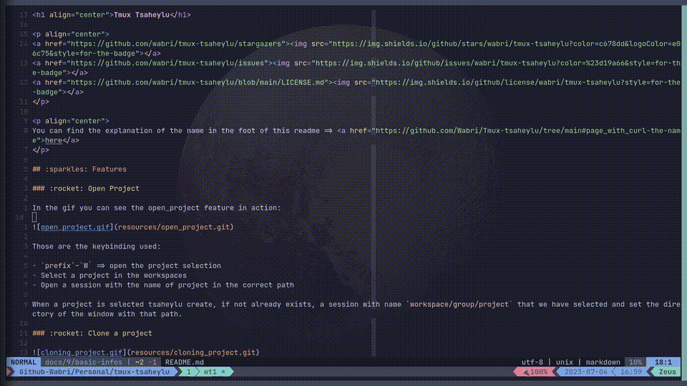
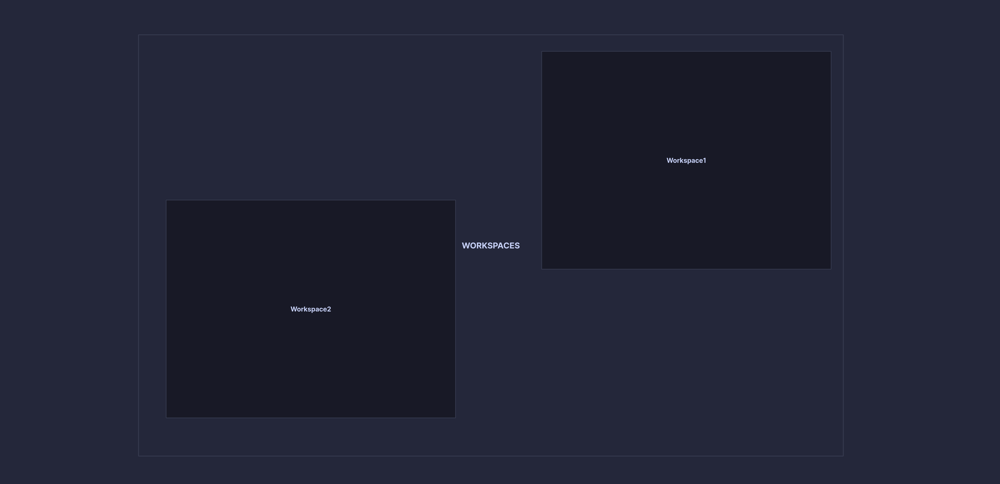

<h1 align="center">Tmux Tsaheylu</h1>

<p align="center">
<a href="https://github.com/wabri/tmux-tsaheylu/stargazers"></a>
<a href="https://github.com/wabri/tmux-tsaheylu/issues"></a>
<a href="https://github.com/wabri/tmux-tsaheylu/blob/main/LICENSE.md"></a>
</p>

<p align="center">
You can find the explanation of the name in the foot of this readme => <a href="https://github.com/Wabri/Tmux-tsaheylu/tree/main#page_with_curl-the-name">here</a>
</p>

## :sparkles: Features

### :rocket: Open Project

In the gif you can see the open_project feature in action:


Those are the steps:

- `prefix`–`W` => open the project selection
- Select a project in the workspaces
- Open a session with the name of project in the correct path

When a project is selected, tsaheylu create, if not already exists, a session with name `workspace/group/project` that we have selected and set the directory of the window with that path.

### :rocket: New Project


Those are the steps:

- `prefix`–`N` => open the type the name popup
- Type the name of the project
- Select a workspace (it is possible to create a new one)
- Select a group of the workspace (it is possible to create a new one)

The project newly created have the git initialization already done without any remote.

### :rocket: Clone a project



Those are the steps:

- `prefix`–`G` => open the cloning popup
- Paste the url
- Select a workspace (it is possible to create a new one)
- Select a group of the workspace (it is possible to create a new one)

After those selection the project will be clone as expected and once the project is correctly cloned than create a new session with the same rules used for [open project](#rocket-open-project).

### :rocket: Manage gitworktree

#### Add feature


Those are the steps:

- `prefix`–`g` => open the worktree manager
- Type `add` => create a new worktree
- Select the branch to checkout into that worktree

After that last step a new worktree will be open and tmux move into it.

#### List and move features


Those are the steps:

- `prefix`–`g` => open the worktree manager
- Type `list` => list all the worktree active
- Type `y` to do something else
- Type `move` => move to an active worktree

#### Remove feature


Those are the steps:

- `prefix`–`g` => open the worktree manager
- Type `remove` => remove an existing worktree
- Select the worktree to remove
- Confirm the action with `y` => remove worktree and directory used for it

### :rocket: Manage templates

A template is a directory with files that are needed to be apply.


Those are the steps:

- `prefix`–`T` => open the template manager
- Type `golang` => search the golang template
- Apply the template
  - In these case my template have only 1 change to apply
  - Every changes will append the files if the file already exists, below the extended example:
    

By default the directory where the template must be is `~/Templates/Tmux-Tsaheylu`, for example in my case I have those:

```
.
└── Tmux-Tsaheylu
    ├── Bash
    ├── default
    ├── GitCredentials
    ├── Golang
    └── Python3
```

When a template is added the file `.template.tsaheylu` is update with the name of the template in order to keep track of every template used in the project.

**NB: When a new [Worktree](#:rocket:_Manage_gitworktree) is created all the template found in the worktree will be apply to the new one.**

## :wrench: Configuration

The default configuration:

```bash
set -g @workspace_dir '~/Workspaces'    # Set the workspaces bucket
set -g @template_dir '~/Templates/Tmux-Tsaheylu'    # Set the template bucket
set -g @worktree_abilitate 'true'       # Abilitate or not the worktree (true|false)
set -g @bind_open_project 'W'           # Change binding of [open project](#rocket-open-project)
set -g @bind_cloning_project 'G'        # Change binding of [cloning project](#rocket-clone_a_project)
set -g @bind_template_selection 'T'        # Change binding of [cloning project](#rocket-clone_a_project)
```

## :package: Installation

### Via TPM (recommended)

The easiest way to install `tmux-tsaheylu` is via the [Tmux Plugin Manager](https://github.com/tmux-plugins/tpm).

1.  Add plugin to the list of TPM plugins in `.tmux.conf`:

    ```tmux
    set -g @plugin 'wabri/tmux-tsaheylu'
    ```

2.  Use `prefix`–`I` install `tmux-tsaheylu`. You should now be able to `tmux-tsaheylu` immediately.
3.  When you want to update `tmux-tsaheylu` use `prefix`–`U`.

### Manual Installation

1.  Clone the repository

    ```sh
    $ git clone https://github.com/wabri/tmux-tsaheylu ~/clone/path
    ```

2.  Add this line to the bottom of `.tmux.conf`

    ```tmux
    run-shell ~/clone/path/tsaheylu.tmux
    ```

3.  Reload the `tmux` environment

    ```sh
    # type this inside tmux
    $ tmux source-file ~/.tmux.conf
    ```

You should now be able to use `tmux-tsaheylu` immediately.

### Requirements

In order for `tmux-tsaheylu` to work, there must be [fzf](https://github.com/junegunn/fzf) installed.

## :microscope: Method use to manage workspaces

### Workspace structure

This plugin can manage workspaces that have at least 3 level consist in:

- level 1: workspace
- level 2: group
- level 3: project
- level 4(optional): worktree

Below you can find some explanation!

### Top down explanation

#### The workspaces bucket


#### Inside the bucket there are a lot of workspaces



#### Inside a single workspace there are a lot of groups


#### Inside a group there are a lot of projects


#### Inside a project there are one or more worktrees


And yes the worktrees are rapresented as triangles because they are trees.

### The problems

On my daily job I have 3 main problem:

1. many hosting server or clients where i need to work on (including my personal projects), let's call them **Workspaces**
2. on every workspaces I need to sort every projects based on the ownership, let's call them **Groups**
3. I work on different **Projects**
   - some of them needs time to be accepted or tested and this could take a lot of times
   - some of them have different static branches and don't want to checkout everytime in one to another
   - more that don't remember :)

To solve this I create the **WGPW** method (I swear that the fact that my alias is **W**abri and my real name is **G**abriele **P**uliti is a coincidence). This method consist in organize every single project in directory and subdirectory like this:

**W**orkspace/**G**roup/**P**roject/**W**orktree

WGPW is a method (I'm still thinking about change the name with a more easy to remember one) of micromanaging the projects: every project is open as a [git-worktree](https://git-scm.com/docs/git-worktree) in a related group of a defined workspace.

### Why works? (at least for me)

- Because if I do not remember the name of the project, maybe I remember the owner or the client
- Because if I need to copy paste something from a branch to another I do not want to stash, checkout, copy, checkout, pop the stash, paste (yes the existence of cherry-pic solve this issue, but not when you need only a part of the commit)
- More then one clients means more than one git authentication and/or ssh keys. using this method is possible to use direnv or gitconfig sourcing without micromanaging or solve a bad commit sign
- This method fit perfectly with management through direnv and asdf (and I use both of them)

## :page_with_curl: The name

The name comes from the Avatar film:

```
The Na'vi can commune with animals on their planet by literally plugging their
braid into the creatures' nerve systems.

To become a warrior, a Na'vi must tame and ride a flying creature known as
Ikran.

The Na'vi also use this neural bonding system, called "tsaheylu", to mate with
a "life partner", a bond that, when made, cannot be broken in the Na'vi's
lifetime.
```

In this case Ikran is rappresented by Tmux. This plugin recall the connection from us and tmux, but also from all the tool we use in our personal development environment such direnv and asdf, but also neovim and lsp.

I tend to be very precise in the organization of projects, this allow me to make the best use of tools such as asdf and direnv. Using the method I explained above ([Method use to manage workspaces](#microscope-method-use-to-manage-workspaces)) I can define an environment for each level so that I can move from one project to the next without problems and without worrying about: environment variables, create commits with the wrong user or run something in the wrong cloud.
